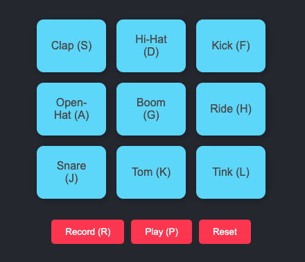

# BizaPad Sound Pad

  

BizaPad is an interactive web-based sound pad that allows users to create and play sequences of sounds using their keyboard or by clicking buttons. It's designed for anyone interested in creating beats.

This is still a work in progress. Feel free to suggest or add a cooler version!

## Features

- **Interactive Sound Buttons**: Play sounds by clicking buttons or pressing keyboard keys.
- **Recording Capability**: Record sequences of sounds.
- **Playback**: Play back recorded sequences.
- **Reset Functionality**: Reset the recording to start a new sequence.

### Soon

- **Dynamic Visual Timeline**: Visual representation of recorded sequences.
- **More sound buttons.**
- **Download mp3 files of a created track.**
